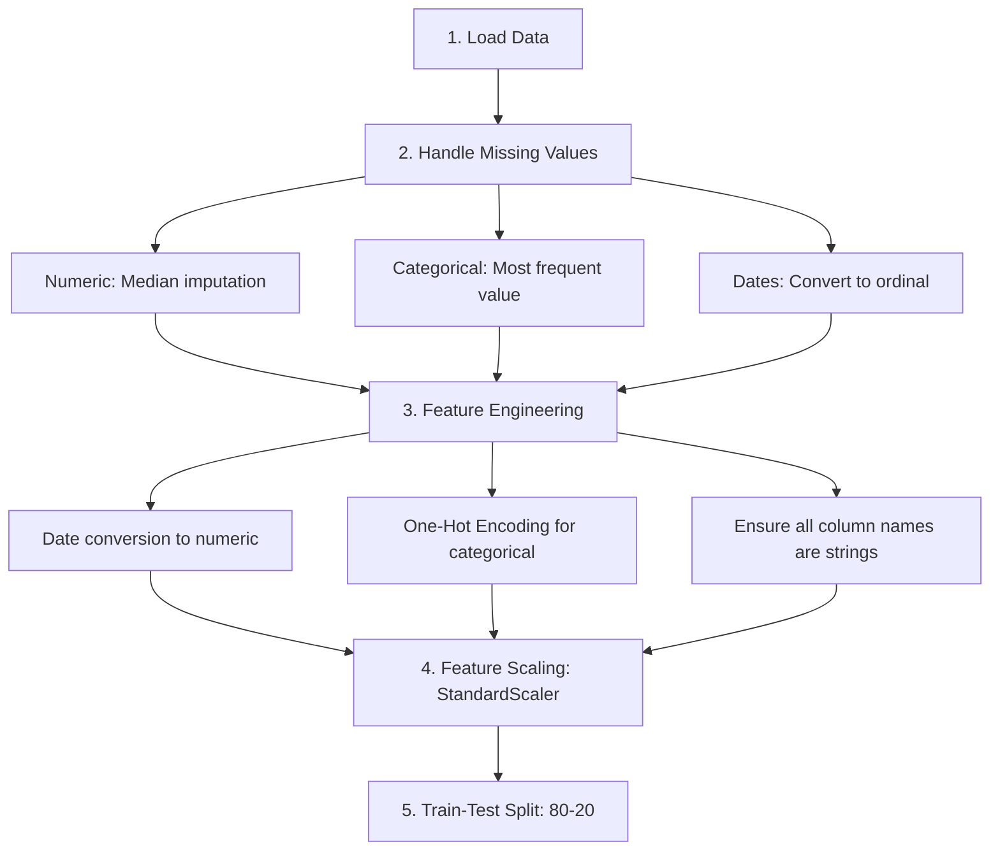

# PII Leak Detection in Public API using AI

An advanced machine learning system for detecting personally identifiable information (PII) leaks and anomalies in API responses using multiple deep learning and ensemble techniques.

## 📋 Project Overview

This project implements a comprehensive data leakage detection system that identifies when sensitive personal information is being exposed through public APIs. It uses three complementary AI approaches:

1. **Isolation Forest** - Unsupervised anomaly detection
2. **Autoencoder Neural Network** - Deep learning-based anomaly detection
3. **Random Forest Classifier** - Supervised ensemble learning

### Key Features
- **Multi-Model Approach**: Combines different detection techniques for robust anomaly identification
- **Deep Learning Integration**: Uses TensorFlow Autoencoder for pattern recognition
- **Ensemble Methods**: Leverages Random Forest for high-accuracy classification
- **Unsupervised Learning**: Isolation Forest for detecting novel anomalies
- **Comprehensive Evaluation**: Detailed metrics including precision, recall, F1-score, and AUC-ROC
- **Data Preprocessing Pipeline**: Handles missing values and categorical encoding

## 🗂️ Project Structure

```
PII-Leak-Detection-in-Public-API-using-AI/
├── README.md                      # Project documentation
├── data_leakage_detection.py      # Main ML pipeline implementation
├── Data_Leakage_Detection.csv     # Dataset (configure path as needed)
└── requirements.txt               # Python dependencies (if available)
```

## 📊 Dataset

- **Dataset**: Data_Leakage_Detection.csv
- **Target Variable**: Abnormality (Binary: 0 = Normal, 1 = Anomalous)
- **Features**: Mixed numeric and categorical attributes
- **Train-Test Split**: 80-20 ratio
- **Preprocessing**: Handles missing values, categorical encoding, and feature scaling

## 🔧 Installation

### Prerequisites
- Python 3.7 or higher
- pip package manager
- GPU support (optional, for faster training)

### Setup

```bash
# Clone the repository
git clone https://github.com/Kalyan-Subramani/PII-Leak-Detection-in-Public-API-using-AI.git
cd PII-Leak-Detection-in-Public-API-using-AI

# Create virtual environment (optional but recommended)
python -m venv venv
source venv/bin/activate  # On Windows: venv\Scripts\activate

# Install required packages
pip install -r requirements.txt
```

### Required Packages
```
pandas
numpy
scikit-learn
tensorflow
keras
matplotlib
seaborn
plotly
```

## 🚀 Usage

### Running the Complete Pipeline

```bash
python data_leakage_detection.py
```

This executes all three detection models:

#### 1. Isolation Forest Model
```python
# Detects anomalies using isolation-based algorithm
isolation_forest = IsolationForest(
    n_estimators=1000,
    max_samples=0.8,
    contamination=0.2,
    max_features=0.75,
    random_state=42
)
```

#### 2. Autoencoder Neural Network
```python
# Deep learning model for unsupervised anomaly detection
autoencoder = Model(input_layer, decoded)
autoencoder.compile(optimizer=Adam(learning_rate=0.001), loss='mse')
autoencoder.fit(X_train, X_train, epochs=50, batch_size=32)
```

#### 3. Random Forest Classifier
```python
# Supervised learning for binary classification
random_forest_model = RandomForestClassifier(
    class_weight='balanced',
    random_state=42
)
```

## 📈 Model Performance Comparison

| Model | Accuracy | Precision (Normal) | Recall (Normal) | F1-Score (Normal) |
|-------|----------|-------------------|-----------------|-------------------|
| Isolation Forest | 62% | 68% | 73% | 70% |
| Autoencoder | 67% | 86% | 75% | 80% |
| Random Forest | 70% | 76% | 83% | 79% |

**Performance Metrics by Class:**

**Isolation Forest (Validation Set)**
- Normal (0): Precision: 68%, Recall: 73%, F1: 70%
- Anomalous (1): Precision: 47%, Recall: 41%, F1: 44%

**Autoencoder**
- Normal (0): Precision: 86%, Recall: 75%, F1: 80%
- Anomalous (1): Precision: 24%, Recall: 39%, F1: 30%
- AUC-ROC Score: High threshold-dependent performance

**Random Forest**
- Normal (0): Precision: 76%, Recall: 83%, F1: 79%
- Anomalous (1): Precision: 53%, Recall: 43%, F1: 48%
- ROC AUC Score: Computed from probability predictions

## 🔍 Key Components

### Data Preprocessing Pipeline



### Isolation Forest Approach

**Strengths:**
- Fast and scalable
- No assumptions about data distribution
- Handles high-dimensional data well
- Effective for rare event detection

**Configuration:**
- n_estimators: 1000 (number of isolation trees)
- max_samples: 0.8 (subsample size)
- contamination: 0.2 (expected anomaly proportion)
- max_features: 0.75 (feature randomness)

### Autoencoder Approach

**Architecture:**
```
Input Layer (input_dim)
    ↓
Dense(6, activation='relu')    [Encoder]
    ↓
Dense(input_dim, activation='sigmoid')  [Decoder]
    ↓
Output Layer (reconstructed)
```

**Training Details:**
- Loss Function: Mean Squared Error (MSE)
- Optimizer: Adam (learning_rate=0.001)
- Epochs: 50
- Batch Size: 32
- Anomaly Detection: Threshold = 95th percentile of reconstruction error

### Random Forest Approach

**Advantages:**
- Handles mixed feature types naturally
- Captures non-linear relationships
- Provides feature importance scores
- Robust to class imbalance with balanced weights

**Configuration:**
- class_weight: 'balanced' (handles class imbalance)
- Supports multi-class and binary classification
- Provides probability predictions for ROC-AUC

## 📊 Detailed Analysis

### Preprocessing Steps

1. **Data Loading**: Load CSV file with all features
2. **Missing Value Handling**: 
   - Numeric columns: Fill with median
   - Categorical columns: Fill with most frequent value
3. **Date Processing**: Convert date strings to ordinal numbers
4. **Categorical Encoding**: One-Hot Encoding for categorical features
5. **Feature Scaling**: Standardize all features to mean=0, std=1
6. **Final Cleanup**: Fill any remaining NaNs with 0

### Evaluation Metrics

- **Accuracy**: Overall correctness of predictions
- **Precision**: True positives / (True positives + False positives)
- **Recall**: True positives / (True positives + False negatives)
- **F1-Score**: Harmonic mean of precision and recall
- **Confusion Matrix**: True/False positives and negatives
- **AUC-ROC**: Area under the Receiver Operating Characteristic curve

## 🎯 Model Selection Guide

### Use Isolation Forest when:
- ✓ Looking for speed and scalability
- ✓ Dealing with high-dimensional data
- ✓ Expecting few labeled anomalies
- ✗ Needs high precision for critical applications

### Use Autoencoder when:
- ✓ Working with complex, non-linear patterns
- ✓ Have sufficient computational resources
- ✓ Need deep learning capabilities
- ✓ Want unsupervised anomaly detection

### Use Random Forest when:
- ✓ Have labeled training data
- ✓ Need interpretable features
- ✓ Require balanced precision and recall
- ✓ Need fast inference time

## 📌 Important Notes

1. **Dataset Path**: Update the CSV file path in the script to match your environment
2. **Data Quality**: Ensure the dataset has proper 'Abnormality' column
3. **Feature Scaling**: All models benefit from normalized features
4. **Class Imbalance**: Random Forest uses balanced weights; consider oversampling/undersampling for Isolation Forest
5. **Threshold Tuning**: Adjust contamination and reconstruction_error thresholds based on business requirements

## 🔒 Privacy & Security Considerations

- This system is designed to DETECT PII leaks, not to enable them
- Ensure proper data handling and compliance with:
  - GDPR (General Data Protection Regulation)
  - CCPA (California Consumer Privacy Act)
  - HIPAA (Health Insurance Portability and Accountability Act)
- Use in production only with appropriate security measures
- Regularly audit model predictions for bias

## 📚 Visualization Features

The script includes comprehensive visualizations:

```python
# Comparison plots for all three models:
- Precision comparison by class
- Recall comparison by class
- F1-score comparison by class
- Overall accuracy comparison bar chart

# Generated using:
- Matplotlib for static plots
- Seaborn for enhanced styling
- Plotly for interactive visualizations (if integrated)
```

## 🚀 Deployment Recommendations

### Production Pipeline
```
Data Ingestion (API logs)
    ↓
Preprocessing
    ↓
Feature Extraction
    ↓
Model Inference (Ensemble voting)
    ↓
Alert Generation
    ↓
Logging & Monitoring
```

### API Integration
```python
# Example for REST API integration
@app.route('/predict', methods=['POST'])
def predict():
    data = request.json
    prediction = model.predict(data)
    return {'anomaly': bool(prediction), 'confidence': confidence_score}
```

## 📖 References

- [Scikit-learn Documentation](https://scikit-learn.org/)
- [TensorFlow/Keras Documentation](https://www.tensorflow.org/)
- [Anomaly Detection Techniques](https://towardsdatascience.com/anomaly-detection)
- [Autoencoder in Anomaly Detection](https://keras.io/examples/timeseries/timeseries_anomaly_detection/)

## 🤝 Contributing

Contributions are welcome! Please:
1. Fork the repository
2. Create a feature branch (`git checkout -b feature/AmazingFeature`)
3. Commit your changes (`git commit -m 'Add some AmazingFeature'`)
4. Push to the branch (`git push origin feature/AmazingFeature`)
5. Open a Pull Request

## 📄 License

This project is open source and available under the MIT License.

## 👤 Author

**Kalyan Subramani**
- GitHub: [@Kalyan-Subramani](https://github.com/Kalyan-Subramani)

## 🙏 Acknowledgments

- TensorFlow and Keras communities
- Scikit-learn maintainers
- Data science research community
- Open source contributors
